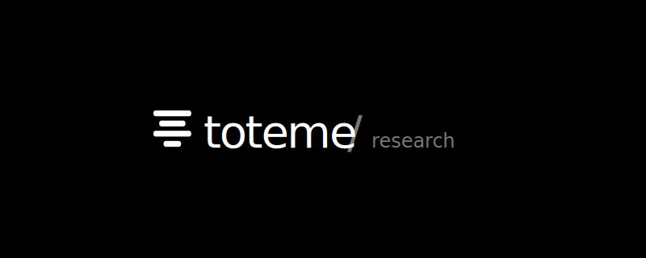

# TOTEME · Logo System

The brand mark for `toteme / research` — a personal Korean equity research
terminal. This document is the source of truth for logo usage, spacing, color,
and code. When in doubt, refer here before introducing variations.



---

## 1. Concept

The lockup is a hybrid of two ideas that survived a multi-round mockup
exploration (see `logo-mockups.html`):

- **Mark (variant 05)** — four horizontal bars of varying widths, abstracted
  from the segmented carving of a totem pole. Reads as "stack" and
  "structure" — appropriate for a tool that processes stacked time-series
  market data.
- **Lockup (variant 01)** — `toteme / research` slash subtitle. The slash
  evokes a CLI / dev-tool register, and the secondary `research` tag makes the
  brand's purpose readable without a tagline.

Final lockup: **`▤ toteme / research`** (mark + wordmark + slash + tag).

---

## 2. Anatomy

```
┌──────────┬────────────────┬───┬────────────┐
│   MARK   │   WORDMARK     │ / │    TAG     │
│ (4 bars) │   "toteme"     │   │ "research" │
└──────────┴────────────────┴───┴────────────┘
   center      baseline       baseline   baseline
```

| Part | Element | Role |
|------|---------|------|
| Mark | 4 stacked bars | Iconic identifier; works alone as favicon |
| Wordmark | `toteme` | Primary brand name, lowercase |
| Separator | `/` | Soft divider, lighter weight |
| Tag | `research` | Category/scope label, smaller and muted |

---

## 3. The Mark — bars

Built in a **32 × 32 viewBox**.

| Bar | Width | y    | x  |
|-----|-------|------|----|
| 1   | 26    | 3.5  | 3  |
| 2   | 18    | 10.5 | 7  |
| 3   | 26    | 17.5 | 3  |
| 4   | 12    | 24.5 | 10 |

- **Bar height:** 4 px · **Gap:** 3 px · **Corner radius:** 1.5 px
- **Pattern:** wide / medium / wide / narrow — must not be re-ordered.
- **Centered** horizontally and vertically in the viewBox.
- **Fill:** `currentColor` so it inherits theme color.

For darker contexts (fill black) and lighter contexts (fill `#1d1d1f`), the
provided SVGs use `prefers-color-scheme` to flip automatically.

---

## 4. Typography

| Element   | Font                | Weight | Letter-spacing | Notes |
|-----------|---------------------|-------:|----------------|-------|
| Wordmark  | SF Pro Display      | 500–600| −1px to −2.2px | Lowercase only |
| Separator | SF Pro Display      | 300    | 0              | Same size as wordmark |
| Tag       | SF Pro Display      | 400    | −0.3 to −0.4px | ~50% of wordmark size |

Fallback stack: `'SF Pro Display','Helvetica Neue',Helvetica,Arial,sans-serif`.

**Wordmark is always lowercase.** Never `TOTEME`, never title-case.

---

## 5. Color

The lockup is monochromatic — never use brand colors on the mark or wordmark.
Only the separator and tag carry a muted/secondary color.

### Dark surface (default)
```
mark + wordmark : #ffffff
separator + tag : rgba(255,255,255,0.48)
```

### Light surface
```
mark + wordmark : #1d1d1f
separator + tag : rgba(0,0,0,0.48)
```

### Terminal Night (warning-active mode)
```
mark + wordmark : var(--tm-accent)    /* #ffffff */
separator + tag : var(--tm-text-mute) /* #7A7A7E */
```

---

## 6. Layout & Spacing

| Context         | Mark height | Wordmark | Sep | Tag | Gap | Mark→text |
|-----------------|------------:|---------:|----:|----:|----:|----------:|
| Nav bar (30px)  | 14px        | 13px     | 13px| 11px| 4px | 2px       |
| About hero      | 26px        | 32px     | 32px| 16px| 6px | 4px       |
| Standalone logo | 25px (svg)  | 26px     | 26px| 14px| (in svg) | (in svg) |
| Hero showcase   | 45px        | 56px     | 56px| 24px| (in svg) | (in svg) |

### Alignment rules
- Container: `display: inline-flex; align-items: baseline; line-height: 1`
- Wordmark / separator / tag: **baseline-aligned** so the smaller `research`
  sits at the bottom edge of `toteme`.
- Mark: **`align-self: center`** — vertically centered against the wordmark
  cap-height, NOT baseline-aligned. (Baseline-aligning the mark would push it
  below the text.)

### Implementation snippet (CSS)
```css
.brand-lockup {
  display: inline-flex;
  align-items: baseline;
  gap: 4px;             /* tighter inside nav, 6px in hero */
  line-height: 1;
}
.brand-lockup .mark   { align-self: center; fill: currentColor; }
.brand-lockup .text   { font-weight: 600; letter-spacing: -0.3px; }
.brand-lockup .sep    { font-weight: 300; color: var(--text-muted); }
.brand-lockup .tag    { font-weight: 400; color: var(--text-muted);
                        font-size: ~50% of .text; }
```

### HTML pattern
```html
<a href="/" class="brand-lockup" aria-label="toteme / research">
  <svg class="mark" viewBox="0 0 26 25" aria-hidden="true">
    <rect x="0" y="0"  width="26" height="4" rx="1.5"/>
    <rect x="4" y="7"  width="18" height="4" rx="1.5"/>
    <rect x="0" y="14" width="26" height="4" rx="1.5"/>
    <rect x="7" y="21" width="12" height="4" rx="1.5"/>
  </svg>
  <span class="text">toteme</span>
  <span class="sep" aria-hidden="true">/</span>
  <span class="tag">research</span>
</a>
```

---

## 7. Do's and Don'ts

### Do
- Use lowercase `toteme` — always.
- Keep the four-bar pattern with the exact width sequence (26/18/26/12).
- Baseline-align the text spans so `research` sits at the bottom.
- Center the mark vertically against the wordmark cap-height
  (`align-self: center`), not on the baseline.
- Use `currentColor` on bars so the mark inherits its container's color.
- Keep the separator weight 300 — visibly lighter than the wordmark.
- Bust browser caches when changing CSS (`?v=YYYYMMDD-N` query string on
  `app.css` and `app.js` in `index.html`).

### Don't
- Don't use `TOTEME` in caps anywhere on the page (meta tags can stay caps).
- Don't replace bars with circles, triangles, or any other geometry.
- Don't recolor the bars — they are monochromatic.
- Don't separate the mark from the wordmark in primary brand placements
  (favicon-only is fine; about-hero/nav must show full lockup).
- Don't make the slash the same weight as the wordmark — it should feel
  thinner.
- Don't title-case `Research` — it stays lowercase like the wordmark.
- Don't use `font-size: inherit` on the lockup container without setting an
  explicit value somewhere — it broke baseline alignment once.

---

## 8. File Inventory

| Path                       | Purpose                                  |
|----------------------------|------------------------------------------|
| `assets/favicon.svg`       | Mark only, 32×32, prefers-color-scheme aware |
| `assets/logo.svg`          | Full lockup, 260×32, for OG / external use |
| `assets/logo-hero.svg`     | Showcase image on dark, 800×320          |
| `logo-mockups.html`        | Design exploration history (8+ variants) |
| `assets/app.css`           | `.nav-title .brand-*`, `#page-about .about-brand-*` |
| `index.html`               | Lockup applied in `nav-title` and `about-hero h1` |

---

## 9. Generating raster (PNG) versions

If a placement requires PNG (e.g. social OG images, app store icons), convert
from the SVG sources rather than re-drawing:

```bash
# macOS — via librsvg (brew install librsvg)
rsvg-convert -w 1200 -h 630 assets/logo-hero.svg > og-image.png

# or using sips (built-in, lower quality)
qlmanage -t -s 1200 -o . assets/logo-hero.svg
```

Always export from `logo-hero.svg` (has built-in padding) for hero/OG use,
or from `favicon.svg` for square icon contexts.

---

## 10. History

- **2026-04-25** — Final lockup applied site-wide. Eight variants explored;
  `bars mark` (#05) + `slash subtitle` (#01) selected. See commit
  `1f6831b` for the rebrand and `8898295` for the baseline-alignment fix.
- **Pre-rebrand** — Brand was `Shamanism Research` / `TOTEME` (caps).
  Replaced with the new lockup system.
